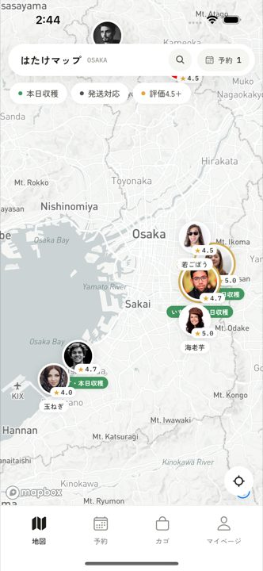
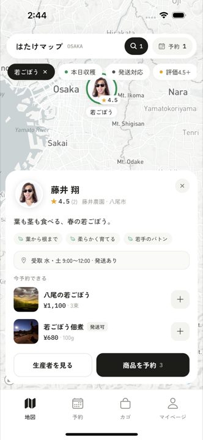
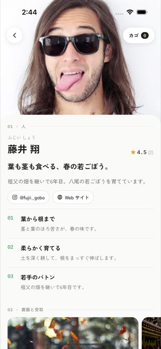
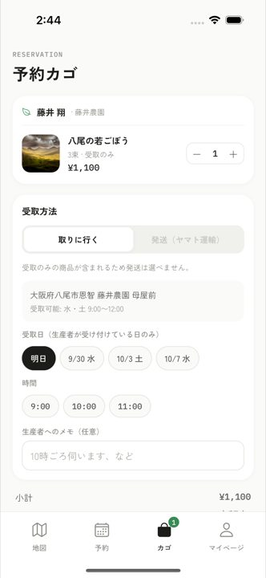
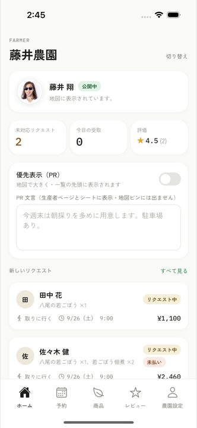

# はたけマップ 🥬

**地図で生産者の顔を見て、野菜を予約して、畑まで取りに行けるアプリ。**

スーパーの野菜は「誰が育てたか」がほとんど分かりません。はたけマップでは、地図の上に農家さん（生産者）の **顔写真** が並びます。気になる人をタップして、こだわりやレビューを読んでから予約。あとは決めた日時に畑へ取りに行くだけ。遠ければ宅急便でも届きます。

農家さん側にも専用の画面があり、予約の受付・受け渡し・発送・お客さまの評価までスマホで完結します。

▶ **Web 版で試す: https://niwayukun-1234.github.io/hatake-map/**
（「消費者として使う」を選ぶとデモデータの入った地図が開きます。アプリ本体は iOS 向けで、TestFlight で配布できる状態です）

## スクリーンショット

<p>
  
  
  
  
  
</p>

| 1. 地図 | 2. 生産者シート | 3. 生産者ページ | 4. 予約カゴ | 5. 生産者アプリ |
| --- | --- | --- | --- | --- |
| 地図に生産者の顔と ★ 評価が並ぶ | ピンをタップすると、こだわりと今予約できる商品が出る | 商品より先に「人」を見せる | 生産者が受け付けている日時から選ぶ | 未対応のリクエスト・評価・PR 設定 |

（iOS シミュレータで Maestro の E2E テストを流したときに撮った実際の画面です）

## どんな課題を解くのか

- **買う人**: 「この野菜は誰がどこで作ったのか」を知りたい。でも直売所や農家を探す手段がバラバラ。
- **作る人**: 直接売りたいけれど、予約・受け渡し・発送・集金を自分で回すのが大変。
- **はたけマップ**: 生産者を地図で見つけられるようにし、予約から受け渡し・支払い・レビューまでを 1 つのアプリにまとめた。

## 使い方

### 買う人（消費者）

1. 地図で近くの生産者を探す。キーワード・「本日収穫」・「発送対応」・「評価 4.5 以上」・作物で絞り込める。
2. ピンをタップ → ひとこと・こだわり・受取時間・今予約できる商品がシートで出る → 生産者ページへ。
3. 商品を予約カゴへ。受取方法は「取りに行く（受付時間帯から日時を選ぶ）」か「発送（ヤマト運輸の宅急便、送料 ¥880）」。
4. 予約をリクエスト → 生産者が確定 → カード決済（テストモード）→ 受け取り。
5. 受取後に ★ とコメントでレビュー。まだ売っていない「出荷予定」の商品はウォッチしておくと、販売開始を予約タブで知らせてくれる。

### 作る人（生産者）

- プロフィール（顔写真・こだわり 3 か条・受取場所と時間帯・SNS・畑の位置）を登録すると「承認待ち」になる。
- 予約リクエストを確定／辞退。受取は「受取完了」、発送は追跡番号を入れて「発送済み」に。未払いの受取は現地払いとしても完了できる。
- 商品の追加・編集（本日収穫・発送対応・在庫・公開/非公開・出荷予定日）。出荷予定の商品には何人がウォッチしているかが見える。
- お客さまを ★ で評価できる（その評価は生産者同士だけが見られる。Airbnb 方式の双方向評価）。
- 受け取ったレビューの一覧と ★ の分布、PR 表示のオン／オフ。

### 運営

- 承認待ちの生産者を承認／却下する。承認された瞬間に地図に載る。起動画面のタイトルを 1.5 秒長押しすると開く隠し導線。

## 主な機能

- **顔から始まる生産者ページ**: 「01 人 → 02 農園と受取場所 → 03 商品 → 04 レビュー」の順。写真・ふりがな・キャッチコピー・こだわり・SNS・畑の場所まで一画面で分かる。
- **地図がそのまま検索結果**: 承認済みの生産者だけが地図に出る。ピンには顔写真と ★ 評価。PR 中の生産者はピンが大きく、一覧では先頭に。
- **予約は「曜日 × 時間帯」**: 生産者が登録した受取時間帯の中からしか日時を選べない。時間帯外・過去の日時・未承認の生産者への予約はサーバー側でも弾く。
- **受取と発送の両対応**: 発送は支払い後に出荷。予約の状態は リクエスト → 確定 → 受取完了 で一貫。
- **決済**: カード決済（テストモード）で事前払い。畑での受取は現地払いでも完了できる。
- **双方向レビュー**: 消費者 → 生産者（公開）、生産者 → 消費者（生産者間だけで共有）。
- **出荷予定のウォッチ**: 発売前の商品を先に載せて需要を測れる。
- **承認制**: 新規の生産者は運営が承認するまで地図に出ない。
- **リアルタイム**: 生産者が予約を確定した瞬間に、消費者の画面も切り替わる（Convex のリアルタイム同期）。

## 技術スタック

| 領域 | 使用技術 |
| --- | --- |
| アプリ | Expo SDK 57 / React Native 0.86 / TypeScript / Expo Router（Tabs + Stack、モーダル） |
| 地図 | `react-native-maps`（iOS では Apple Maps。Expo Go でも動く）。Mapbox（`@rnmapbox/maps`）版の実装も `components/FarmerMap.mapbox.tsx` に残してあり、import を差し替えると切り替わる |
| バックエンド | Convex（スキーマ・クエリ・ミューテーション・ファイルストレージ、リアルタイム同期） |
| UI | `@gorhom/bottom-sheet`, Reanimated, expo-image, Zen Kaku Gothic New / IBM Plex Mono |
| 状態管理 | Zustand（ロール・カゴ・絞り込み・トースト） |
| E2E テスト | Maestro（消費者 / 生産者 / 運営の 3 フロー。Expo Go 用・リリースビルド用もあり） |
| 配布 | EAS Build / TestFlight（iOS）、Web 版は GitHub Pages |

## アーキテクチャ


- アプリは Expo Router のファイルベースルーティングで、`app/consumer`・`app/farmer`・`app/admin.tsx` の 3 つの入口に分かれている。起動画面でロールを選ぶ。
- データはすべて Convex に置き、画面は `useQuery` で購読する。予約の作成・状態遷移・支払い・レビューはミューテーションとしてサーバー側で検証する（受付時間帯・承認状態など）。
- 認証はハッカソン用の固定デモ ID（`lib/convex.ts`）。本番運用には Convex Auth などへの置き換えが必要。

### データモデル（Convex）

- `users`: ロール、名前、電話、発送先、ひとこと
- `farmers`: `status`（pending / approved / rejected）, `pr` と `prMessage`, `ownerUserId`, 顔写真・こだわり・受取場所・`pickupSlots`（曜日 × 開始/終了時刻）・SNS・位置
- `products`: `harvestedToday`, `deliveryAvailable`, `stock`, `available`, `expectedAt`（出荷予定日）
- `reservations`: `status`（requested → confirmed → completed | declined | cancelled）, `method`（pickup / delivery）, `pickupAt` / `address`, `paymentStatus`（unpaid / paid）と `paymentMethod`（card / cash）, `carrier` / `trackingNumber`, 明細を埋め込み
- `reviews`: 消費者 → 生産者（公開）
- `consumerRatings`: 生産者 → 消費者（生産者間で参照）
- `watches`: 消費者が出荷予定の商品をウォッチ

### ディレクトリ構成

```
app/
  index.tsx                 起動時のロール選択（タイトル長押しで運営）
  admin.tsx                 運営: 生産者の承認
  consumer/
    (tabs)/                 map / reservations / cart / profile
    farmer/[id].tsx         生産者ページ
    product/[id].tsx        商品
    reservation/[id].tsx    予約詳細
    pay/[id].tsx            カード決済（モーダル）
    review/[id].tsx         レビュー投稿（モーダル）
  farmer/
    (tabs)/                 home / reservations / products / reviews / profile
    reservation/[id].tsx    予約の確定・辞退・完了・発送
    product/[id].tsx        商品の追加・編集（モーダル）
components/                 FarmerMap, FarmerMarker, FarmerBottomSheet, SearchPanel, MapFilters, FloatingCartBar, ProductCard, ReservationCard, ReviewCard, Stars, TabBar, ToastHost, ui
convex/                     schema, farmers, products, reservations, reviews, watches, users, images, assets, seed
lib/                        theme（デザイントークン）, store（Zustand）, map, farmerView, useMyFarmer, convex（デモ ID）
scripts/upload-assets.mjs   デモ写真を Convex File Storage にアップロード
e2e/                        Maestro フロー（consumer / farmer / admin、go/ と release/ も）
docs/screenshots/           README 用スクリーンショット
docs/e2e/                   E2E 実行中に撮った全画面のスクリーンショット
```

## 開発環境

### いちばん早い動かし方（Expo Go）

```bash
npm install --legacy-peer-deps
npx expo start --go        # ターミナルの QR を iPhone の Expo Go（App Store）で読む
```

`.env.local` の `EXPO_PUBLIC_CONVEX_URL` を本番デプロイ（`https://giant-quail-638.convex.cloud`）に向ければ、同じ Wi-Fi にいる端末なら QR だけで動きます。別ネットワークなら `npx expo start --go --tunnel`。Web で見るなら `npm run web`。

### セットアップ

```bash
npm install --legacy-peer-deps
cp .env.example .env.local
```

1. **Convex** を起動: `npm run backend`（= `npx convex dev`）。アカウント無しなら `CONVEX_AGENT_MODE=anonymous npx convex dev` でローカル実行できる。`.env.local` に `EXPO_PUBLIC_CONVEX_URL` が書き込まれる。
2. **シード**: `npm run seed`。大阪の生産者 10 名（うち 1 名は承認待ち）、商品、レビュー、予約のデモデータが入る。
3. **Mapbox（任意）**: Mapbox 版の地図に切り替える場合だけ、`.env.local` の `EXPO_PUBLIC_MAPBOX_TOKEN` に公開トークン（`pk.…`）を設定する。Mapbox は Expo Go では動かないため `npx expo run:ios` でネイティブビルドする。
4. 起動: `npm start`（Expo Go）または `npx expo run:ios`（ネイティブビルド）。

起動すると「消費者 / 生産者（ひろせファームのデモ） / 生産者として新規登録」を選ぶ画面になる。運営はタイトル長押し。

### デモアカウント

| ロール | 名前 | 用途 |
| --- | --- | --- |
| 消費者 | 田中 花 | 地図から予約・レビュー |
| 生産者 | 廣瀬 裕（ひろせファーム） | 承認済み。予約・商品・レビューの管理 |
| 生産者（新規） | 新規の生産者 | プロフィール登録 → 承認待ち |
| 運営 | 運営 | 生産者の承認（タイトル長押し） |

### 動作確認・テスト

```bash
npm run typecheck   # tsc --noEmit
npm run lint        # expo lint
npm run seed && npm run e2e   # Maestro: consumer → farmer → admin
npm run e2e:go                # Expo Go 上で同じフロー
npm run e2e:release           # リリースビルドで同じフロー
```

iOS の Maestro は日本語入力ができないため、フロー内の入力は ASCII。

<details>
<summary>E2E 実行中に撮った全画面（消費者・生産者・承認フロー）</summary>

| 消費者 | | | |
| --- | --- | --- | --- |
|  |  |  |  |
| ロール選択 | 検索・絞り込み | 絞り込み後の地図 | 出荷予定をウォッチ |
|  |  |  |  |
| 商品 | フローティングカゴ | 受取日時を選ぶ | 予約リクエスト |
|  |  |  |  |
| カード決済（テスト） | 予約一覧 | レビュー投稿 | マイページ・生産者からの評価 |

| 生産者 | | | |
| --- | --- | --- | --- |
|  |  |  |  |
| ホーム | 予約管理 | リクエスト詳細 | 受取完了・お客さま評価 |
|  |  |  |  |
| 追跡番号を入れて発送 | 発送済み | 商品 | 商品の追加（出荷予定） |
|  |  |  |  |
| PR のオン／オフと文言 | レビュー | 受取時間帯の設定 | SNS の設定 |

| 承認フロー | | | |
| --- | --- | --- | --- |
|  |  |  |  |
| 新規生産者の初回起動 | 登録 → 承認待ち | 運営が承認 | 公開中 |

</details>

## TestFlight 配布

事前に決めてある値: アプリ名 **はたけマップ** / Bundle ID **jp.hatakemap.app** / scheme `hatakemap`（`app.config.ts`）。

1. **Convex をクラウドへ**（ローカル匿名デプロイは実機から届きません）
   ```bash
   npx convex login
   npx convex deploy                       # 本番デプロイ。URL が表示される
   npx convex run seed:run --prod          # デモデータ投入
   ```
2. **EAS にログインしてプロジェクトを紐づけ**（設定済み: `@rinia/hatake-map`。別アカウントで配る場合は `app.config.ts` の `owner` / `extra.eas.projectId` を書き換える）
   ```bash
   npx eas-cli login
   npx eas-cli init
   ```
3. **ビルド時の環境変数**（バンドルに埋め込まれるため EAS 側に登録。`.env.local` は使われません。確認は `npx eas-cli env:list --environment production`）
   ```bash
   npx eas-cli env:create --environment production --scope project --visibility plaintext \
     --name EXPO_PUBLIC_CONVEX_URL --value https://<deployment>.convex.cloud
   npx eas-cli env:create --environment production --scope project --visibility sensitive \
     --name EXPO_PUBLIC_MAPBOX_TOKEN --value pk.xxx
   ```
4. **ビルドと提出**（Apple Developer Program のアカウントが必要。初回は対話で証明書・App Store Connect のアプリ作成）
   ```bash
   npx eas-cli build --platform ios --profile production
   npx eas-cli submit --platform ios --latest
   ```
   内部テスター（最大 100 名）は審査なしで即配布できます。外部テスターは Beta App Review が必要です。
5. App Store Connect の「App のプライバシー」で位置情報（アプリ機能のため・ユーザーと紐づけない）を申告。

メモ: `ITSAppUsesNonExemptEncryption: false` 設定済み（輸出コンプライアンスの質問をスキップ）。`eas.json` の production は `autoIncrement` でビルド番号を EAS 側（remote）で自動加算するため、`app.config.ts` に buildNumber は持たない。

## 作った人

丹羽優貴（[@niwayukun-1234](https://github.com/niwayukun-1234)）· ポートフォリオ: https://niwayukun-1234.github.io/
